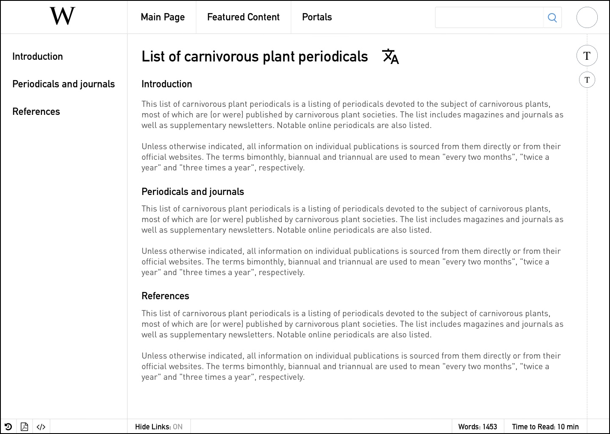

The following is a reconceptualization of Wikipedia and its sister Wikimedia
projects. My primary goals with this project were to increase readability and
ease-of-use across multiple platforms – I do not own Wikipedia (obviously), nor
do I have any official affiliation with them.

**Iteration 1**

I wanted to simplify the design to its bare essentials – Wikipedia, at its core,
is defined by search. One can find any article on any subject on it, but how
does one get there? Unfortunately, this is a bit too simplified. The old
Wikipedia page wastes too much space on switching between languages, but this
removes that functionality entirely, and it misses the core of the Wikimedia
experience, which offers access to free content (books, media, news, taxonomy,
etc.)

 

**Iteration 2**

After doing some research (and examining previous redesign attempts), I started
thinking about how to integrate the different facets of what Wikipedia's landing
screen is supposed to do together. Search is key, but what if it were possible
to integrate the old Wikipedia's language selection area into a single bar at
the top?

**Iteration 3**

Wikipedia's main page is one of the most egregiously bad home pages I've ever
seen – however, there are some interesting concepts behind it, so I tried to
apply to my own take on it. I restructured the page while leaving the key
content and including links to Wikinews and Wikimedia.

**Article View**

One of the things that's always bothered me about the desktop version of
Wikipedia is how much space is wasted on functionality for the sidebar that's
almost never used – it would be much easier to simplify the view and retain some
of the core features like editing, saving articles to PDFs, and showing the talk
page without wasting space on all of the tools and languages that the current
version of Wikipedia does. Why not just use the space for a permanent table of
contents and link to different parts of the article?

**Research View**

This is where I decided to have a bit of fun. Wikipedia is often used
(informally) for research projects and for aggregating information, so I thought
it would be neat to add a section where users could grab information, compile
notes, and link connections together in a single view.

**News/Article Feed**

We all go on Wikipedia for research, but what if it could be used as an
educational tool? I'm always reading about different subjects, so I thought it
could be interesting if subscribed users could receive a daily feed curated to
their past interests along with news and current stories.

 

**Affiliate Links**

All of the examples so far have been of Wikipedia itself – but what about
Wikimedia? There are tons of sister websites to Wikipedia, so how do we
establish a brand? Rather than creating a large number of icons, which take more
time to render on devices, I decided to unify the Wikimedia projects around
text-based icons (shoutout to Wikipedia Redefined) – this creates a visual
palette of icons that are easily identifiable while not relying on complex
vectors.

**Affiliate Landing Screen**

...which would make our landing screen look like this.

**Addendum**

I think there's still more to be done here, but this is a basic idea of what I
was thinking with this redesign. In the next few weeks, I'll be adding a couple
more pages – a connection cloud/mind map, a view of a featured article, more
mobile controls, etc. Thank you for reading! If you enjoyed this, please take a
look at some of my other projects – I'm currently taking on projects, and you
can reach me at <mailto:ofurmadur@icloud.com> if you're interested in speaking.
